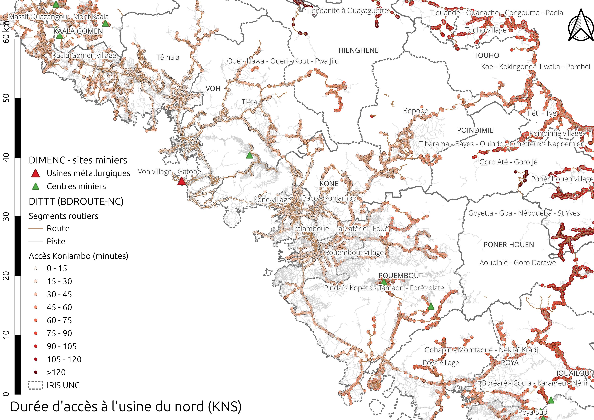

# Élaboration d'une matrice de desserte en Nouvelle-Calédonie

Ce projet a pour but de calculer le _temps de trajet par la route entre les IRIS et des points d'intérêts (POI)_, notamment les sites miniers (centre et usines).
On croise les données suivantes :

- Le réseau routier fourni par la [DITTT](https://dittt.gouv.nc/).
- Les IRIS proposés par l'[ISEE](https://www.isee.nc) pour le projet [CNRT Mine et Territoires - Impact de la mine sur l'évolution des territoires](https://cnrt.nc/mine-et-territoire/).
- Des points d'intérêt comme les sites miniers fournis par la [DIMENC](https://dimenc.gouv.nc/).

## Objectif

Le but est d'obtenir une _matrice de desserte_ où les durées trajets entre les POI et les nœuds du réseau routier sont agrégés par IRIS afin d'estimer la proximité par la route entre les POI et les IRIS.
Un extrait indicatif (les données complètes sont fournies dans le dossier [dist](dist/)) de dix durées de trajets des usines de nickel vers les IRIS est donné ci-après.
L'avant-dernière ligne indique qu'il faut entre 70 et 147 minutes, avec une durée médiane de 105 minutes et une moyenne de 108 minutes, pour aller de l'usine _KNS - Koniambo_ (dite _usine du nord_) aux nœuds routiers situés dans l'IRIS 2306 _Aoupinié - Goro Darawé_ sur la commune de [Ponérihouen](https://fr.wikipedia.org/wiki/Pon%C3%A9rihouen).

```raw
 Code IRIS |              Libellé IRIS              | Code commune | Société |   Site   | Durée minimum | Durée médiane | Durée moyenne | Durée maximum 
-----------+----------------------------------------+--------------+---------+----------+---------------+---------------+---------------+---------------
 2104      | Ondémia Port Laguerre                  |        98821 | VALE NC | Goro     |            92 |            98 |            99 |           118
 1825      | Doniambo - Montagne coupée - Montravel |        98818 | VALE NC | Goro     |            85 |            86 |            87 |            95
 3201      | Waho Touaourou Goro                    |        98832 | VALE NC | Goro     |             8 |            35 |            33 |            50
 1828      | Portes de Fer - Nord                   |        98818 | KNS     | Koniambo |           190 |           191 |           191 |           193
 3101      | Voh village - Gatope                   |        98831 | KNS     | Koniambo |             0 |            10 |            10 |            23
 1706      | Robinson Sud                           |        98817 | VALE NC | Goro     |            77 |            79 |            79 |            85
 2102      | Scheffleras                            |        98821 | SLN     | Doniambo |            18 |            19 |            19 |            29
 1836      | PK 7 Est                               |        98818 | KNS     | Koniambo |           188 |           189 |           189 |           191
 2306      | Aoupinié - Goro Darawé                 |        98823 | KNS     | Koniambo |            70 |           105 |           108 |           147
 1702      | Yahoué Sud                             |        98817 | VALE NC | Goro     |            82 |            83 |            83 |            88
```

## Méthode

Le document [TECHNIQUE.md](TECHNIQUE.md) détaille la méthode employée.
L'intégralité des code est fournie dans le présent dépôt, pour pouvoir reproduire les calculs dans un environnement Linux.
Pour cela, mettre à jour le fichier [scripts/environment](scripts/environment) puis exécuter les scripts `.sh` du dossier [scripts/](scripts/) **dans l'ordre**.

## Résultats




## Documents produits

Les fichiers suivants sont diffusés dans le cadre de cette étude :

- [cnrt_iris_2014.zip](dist/cnrt_iris_2014.zip) les IRIS utilisés dans le projet CNRT Mines et Territoires, au format _ESRI Shapefile_.
- [nb_etab_sante_par_type_commune.csv](dist/nb_etab_sante_par_type_commune.csv) le nombre d'établissements de santé par commune.
- [desserte_mine_iris.csv](dist/desserte_mine_iris.csv) la matrice de desserte entre sites miniers (centres ou usines) par IRIS au format vertical.
  - [desserte_mine_iris_pivot_minimum.csv](dist/desserte_mine_iris_pivot_minimum.csv) : la durée _minimum_ de desserte au format large.
  - [desserte_mine_iris_pivot_mediane.csv](dist/desserte_mine_iris_pivot_mediane.csv) : la durée _médiane_ de desserte au format large.
  - [desserte_mine_iris_pivot_moyenne.csv](dist/desserte_mine_iris_pivot_moyenne.csv) : la durée _moyenne_ de desserte au format large.
  - [desserte_mine_iris_pivot_maximum.csv](dist/desserte_mine_iris_pivot_maximum.csv) : la durée _maximum_ de desserte au format large.
- [desserte_etabs_sante_iris.csv](dist/desserte_etabs_sante_iris.csv) la matrice de desserte entre établissements de santé (hôpitaux, dispensaires, pharmacies ou sage-femmes) par IRIS au format vertical.
  - [desserte_etabs_sante_iris_pivot_minimum.csv](dist/desserte_etabs_sante_iris_pivot_minimum.csv) : la durée _minimum_ de desserte au format large.
  - [desserte_etabs_sante_iris_pivot_mediane.csv](dist/desserte_etabs_sante_iris_pivot_mediane.csv) : la durée _médiane_ de desserte au format large.
  - [desserte_etabs_sante_iris_pivot_moyenne.csv](dist/desserte_etabs_sante_iris_pivot_moyenne.csv) : la durée _moyenne_ de desserte au format large.
  - [desserte_etabs_sante_iris_pivot_maximum.csv](dist/desserte_etabs_sante_iris_pivot_maximum.csv) : la durée _maximum_ de desserte au format large.
