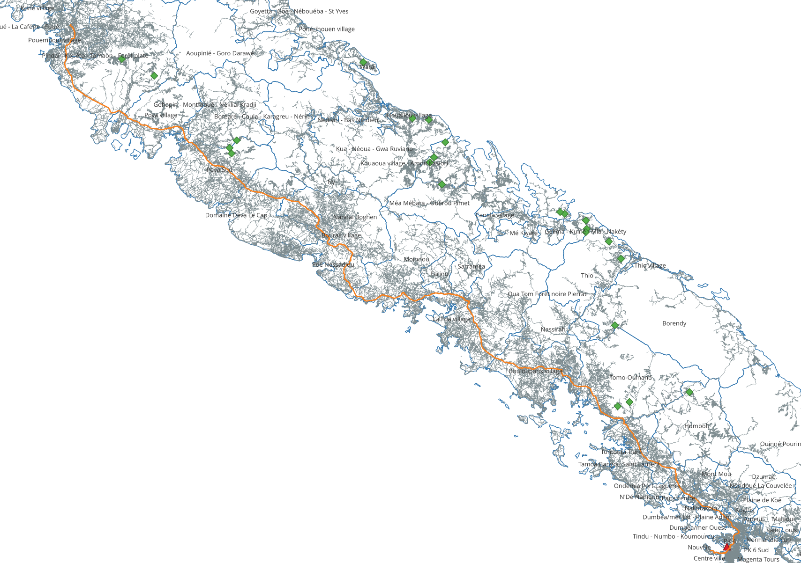

# Élaboration d'une matrice de desserte en Nouvelle-Calédonie

Ce document décrit le calcul du temps de trajet par la route entre les IRIS et des points d'intérêts (POI), notamment les sites miniers (centre et usines) de Nouvelle-Calédonie, en croisant les données suivantes :

- Le réseau routier fourni par la [DITTT](https://dittt.gouv.nc/).
- Les sites miniers fournis par la [DIMENC](https://dimenc.gouv.nc/).
- Les IRIS proposés par l'[ISEE](https://www.isee.nc) pour le projet [CNRT Mine et Territoires - Impact de la mine sur l'évolution des territoires](https://cnrt.nc/mine-et-territoire/).

Le but est d'obtenir une _matrice de desserte_ où les durées trajets entre les POI et les nœuds du réseau routier sont agrégés par IRIS afin d'estimer la proximité par la route entre les POI et les IRIS.
Un extrait indicatif (les données complètes sont fournies dans le dossier [dist](dist/)) de dix durées de trajets des usines de nickel vers les IRIS est donné ci-après.
L'avant-dernière ligne indique qu'il faut entre 70 et 147 minutes, avec une durée médiane de 105 minutes et une moyenne de 108 minutes, pour aller de l'usine _KNS - Koniambo_ (dite _usine du nord_) aux nœuds routiers situés dans l'IRIS 2306 _Aoupinié - Goro Darawé_ sur la commune de [Ponérihouen](https://fr.wikipedia.org/wiki/Pon%C3%A9rihouen).

```raw
 Code IRIS |              Libellé IRIS              | Code commune | Société |   Site   | Durée minimum | Durée médiane | Durée moyenne | Durée maximum 
-----------+----------------------------------------+--------------+---------+----------+---------------+---------------+---------------+---------------
 2104      | Ondémia Port Laguerre                  |        98821 | VALE NC | Goro     |            92 |            98 |            99 |           118
 1825      | Doniambo - Montagne coupée - Montravel |        98818 | VALE NC | Goro     |            85 |            86 |            87 |            95
 3201      | Waho Touaourou Goro                    |        98832 | VALE NC | Goro     |             8 |            35 |            33 |            50
 1828      | Portes de Fer - Nord                   |        98818 | KNS     | Koniambo |           190 |           191 |           191 |           193
 3101      | Voh village - Gatope                   |        98831 | KNS     | Koniambo |             0 |            10 |            10 |            23
 1706      | Robinson Sud                           |        98817 | VALE NC | Goro     |            77 |            79 |            79 |            85
 2102      | Scheffleras                            |        98821 | SLN     | Doniambo |            18 |            19 |            19 |            29
 1836      | PK 7 Est                               |        98818 | KNS     | Koniambo |           188 |           189 |           189 |           191
 2306      | Aoupinié - Goro Darawé                 |        98823 | KNS     | Koniambo |            70 |           105 |           108 |           147
 1702      | Yahoué Sud                             |        98817 | VALE NC | Goro     |            82 |            83 |            83 |            88
```

## Import des données

Ici, on considère les versions suivantes téléchargées le 2024-06-28.

- [BDROUTE-NC](https://georep-dtsi-sgt.opendata.arcgis.com/maps/d3915082450a4405bb30dda99e19bc61/about), version du 14 juin 2023, mise à jour le 11 mars 2024 ;
- [Exploitation minière](https://georep-dtsi-sgt.opendata.arcgis.com/maps/464a23302d6a473a9188ab8e26684206/about), version du 8 juin 2010, mise à jour le 31 mars 2017 ;
- [Limites administratives terrestres](https://georep-dtsi-sgt.opendata.arcgis.com/maps/e1d853903cc64d40af7fbb5ee57e3029/about), version du 23 décembre 2009, mise à jour le 2 mars 2022.
- [IRIS UNC 2014](dist/cnrt_iris_2014.zip), ces fichiers sont fournis par le projet CNRT dans le présent dépôt.

### Création des tables et chargement

Dans une base PostgreSQL supposée déjà créée et configurée, on exécute les scripts [01_download.sh](scripts/01_download.sh) puis [02_import_pg.sh](scripts/02_import_pg.sh) qui vont télécharger les données et les importer.
À l'issue de l'exécution, les tables suivantes sont créées dans la base PostgreSQL, voir le fichier [select_infos.sql](database/select_infos.sql) :

```raw
dittt_noeuds
dittt_segments
dittt_denominations
dimenc_centres
dimenc_usines
bdadmin_communes
cnrt_iris
dass_etabs_sante
```

Les schémas finaux après exécution de toutes les étapes sont donnés en annexe.

### Nettoyage

On exécute le script [alter_tables_pk_fk.sql](database/alter_tables_pk_fk.sql) pour durcir le schéma en ajoutant des clefs alternatives et des clefs étrangères.
On corrige au passage quelques erreurs ponctuelles sur la version du 2024-07-16.
Voir le fichier [03_cleaning.sh](scripts/03_cleaning.sh) qui exécute le fichier `sql`.

### Vérification

Les requêtes SQL suivantes permettent d'apprécier la qualité et le volume des données.

#### Nombre total de kilomètres par type de segment

```sql
SELECT
  seg_type,
  COUNT(*) AS nb,
  ROUND(SUM(ST_Length(wkb_geometry))/1E3) AS long_km
FROM dittt_segments r
GROUP BY seg_type
ORDER BY long_km DESC;

--  seg_type |   nb   | long_km 
-- ----------+--------+---------
--  P        | 201529 |   30557
--  VCU      |  78516 |   10456
--  SP       |  39521 |    7772
--  VR       |    154 |      60
--  PC       |    185 |      43
--  G        |   2660 |      37
--  B        |    165 |      30
--  RP       |   1036 |      17
--  VS       |    106 |      16
--  VCS      |     10 |       4
--  PA       |    238 |       4
-- (11 rows)
```

#### Nombre de segments par IRIS

On regarde le nombre de segments et en particulier ceux de type _pistes_ (valeur `'P'`).
Les pistes sont marginales en zone urbaine, mais prépondérantes en brousse.

```sql
SELECT
  i.code_iris,
  i.lib_iris,
  ROUND(ST_area(i.wkb_geometry)/1E4) AS surface_ha,
  COUNT(n.objectid) AS nb_segments,
  COUNT(n.objectid) FILTER (WHERE seg_type = 'P')::numeric AS nb_pistes,
  ROUND(100 * COUNT(n.objectid) FILTER (WHERE seg_type = 'P')::numeric / COUNT(n.objectid), 2) AS pc_pistes,
  ROUND(1E6*COUNT(n.objectid) / ST_area(i.wkb_geometry))/100 AS segments_par_ha
FROM cnrt_iris i JOIN dittt_segments n ON ST_Contains(i.wkb_geometry, n.wkb_geometry)
WHERE 1=1
GROUP BY i.fid_iris
ORDER BY i.code_iris ASC;

--  code_iris |                     lib_iris                     | surface_ha | nb_segments | nb_pistes | pc_pistes | segments_par_ha 
-- -----------+--------------------------------------------------+------------+-------------+-----------+-----------+-----------------
--  0101      | Bélep                                            |       6433 |         926 |       428 |     46.22 |            0.14
--  0201      | Boulouparis village                              |      25791 |       11324 |      8777 |     77.51 |            0.44
--  0204      | Tomo-Ouinané                                     |      44073 |        7293 |      6398 |     87.73 |            0.17
--  0205      | Nassirah                                         |      16161 |        2823 |      2397 |     84.91 |            0.17
--  0301      | Bourail village                                  |       2074 |        1222 |       558 |     45.66 |            0.59
--  0302      | Poé Nessadiou                                    |      13329 |        3607 |      2268 |     62.88 |            0.27
--  0303      | Domaine Deva Le Cap                              |      28188 |        6943 |      4914 |     70.78 |            0.25
--  0304      | Nandaï Boghen                                    |      29652 |        5670 |      3461 |     61.04 |            0.19
--  0305      | Ny                                               |       6138 |        1368 |       481 |     35.16 |            0.22
--  0401      | Canala village                                   |       5192 |        1617 |       895 |     55.35 |            0.31
--  0403      | Gélima - Kuiné - Mia - Nakéty                    |       4622 |        1713 |      1150 |     67.13 |            0.37
--  0404      | Mé Kwaré                                         |      33393 |        5681 |      5236 |     92.17 |            0.17
--  0501      | Coeur de ville urbain                            |        172 |         455 |        29 |      6.37 |            2.65
--  0502      | Coeur de ville littoral                          |         77 |         160 |         0 |      0.00 |            2.08
--  0503      | Koutio Secal                                     |         79 |         268 |         0 |      0.00 |            3.38
--  0504      | Koutio érudits                                   |         86 |         207 |         4 |      1.93 |            2.41
--  0505      | Koutio Fortunes de mer                           |         77 |         124 |         2 |      1.61 |            1.62
--  0506      | Jacarandas I                                     |        188 |         127 |        13 |     10.24 |            0.68
--  0601      | Farino                                           |       4807 |        1232 |       547 |     44.40 |            0.26

```

#### La longueur de la R.T.1 : 402 km

```sql
SELECT sum(st_length(wkb_geometry))/1e3 AS long_km
FROM dittt_segments JOIN dittt_denominations on seg_nom_gu = nom_guid
WHERE nom_code = 'R.T.1';

--       long_km      
-- -------------------
--  401.6447358156211
```

## Calcul des trajets avec `pgRouting`

Voir le fichier [04_prepare_pgr.sh](scripts/04_prepare_pgr.sh) qui exécute les programmes SQL des trois premières sections.

### Vue des segments au format `pgRouting`

On crée une vue _matérialisée_ `dittt_segments_pgr` qui structure les données sources au [format attendu par `pgRouting`](https://docs.pgrouting.org/3.6/en/pgr_dijkstraNearCost.html#edges-sql).
On prend en compte la direction des segments, la pente et la vitesse maximale autorisée dans le calcul des coûts.
De plus, on réduit les types à trois sur les 11 initiaux, voir le fichier [create_view_pgr.sql](database/create_view_pgr.sql) :

- Les types `VCU`, `VCS`, `B`, `VR`, `A`, `RP` deviennent tous `R`, pour _route_,
- Le type `P` reste `P`, pour _piste_,
- Les autres types, à savoir `PC`, `G`, `PA` et `VS` deviennent `NR`, pour _non route_.

On obtient un extrait comme suit avec la requête `select * from dittt_segments_pgr tablesample bernoulli(.005);`.

```raw
   id   | source | target | seg_type | seg_sens | distance | deniv_m |   total_distance   | speed |        cost        |    reverse_cost    
--------+--------+--------+----------+----------+----------+---------+--------------------+-------+--------------------+--------------------
   3736 | 132158 | 132155 | P        | D        |       57 |       1 |  57.47487104456262 |    30 |  6.896984525347514 |  6.896984525347514
 203290 | 180277 | 199113 | R        | D        |       69 |       3 |  68.88898975360519 |    50 |  4.960007262259573 |  4.960007262259573
 206516 | 185873 | 195805 | R        | D        |       23 |       0 |  23.44438010752035 |    50 |  1.687995367741465 |  1.687995367741465
  18005 |  94222 |  94204 | X        | D        |       79 |       1 |  78.51453385221917 |     5 |  56.53046437359781 |  56.53046437359781
  48567 |  87733 |  87772 | P        | D        |       26 |       0 |  26.38008924283453 |    30 |  3.165610709140143 |  3.165610709140143
  83870 |  73094 |  73060 | X        | D        |      173 |      19 |  174.2559863110222 |     5 |   125.464310143936 |   125.464310143936
  90846 |  62556 |  62624 | P        | D        |       86 |       6 |   86.0641647575717 |    30 | 10.327699770908604 | 10.327699770908604
 119974 | 190934 | 111107 | P        | D        |       97 |       1 |  96.73794243361631 |    30 | 11.608553092033956 | 11.608553092033956
 198439 | 198148 | 197399 | P        | D        |       69 |       0 |  69.17732474378623 |    30 |  8.301278969254348 |  8.301278969254348
 241111 | 208483 | 208970 | P        | D        |      122 |       0 | 122.29569950215429 |    30 | 14.675483940258514 | 14.675483940258514
 252103 | 225378 | 225379 | P        | D        |      280 |       5 | 279.82897145348653 |    30 |  33.57947657441838 |  33.57947657441838
 297747 | 259902 | 258090 | P        | D        |      295 |      23 | 296.24233359406423 |    30 |  35.54908003128771 |  35.54908003128771
(12 rows)
```

#### Trajets de référence

On calcule un trajet de référence entre les deux sites de l'UNC et l'usine du nord :

- Noeud _UNC - site Nouville_ : `objectid = 270424` (type `J`).
  - Point situé au 102 Av. James Cook à Nouville, à l'intersection avec la rue Kataoui.
  - GPS : -22.2619,166.4042
- Noeud _UNC - site Baco_ : `objectid = 200545` (type `FDR`).
  - Point situé au bout du chemin entre l'UNC et la caserne de pompiers, au début de la RPN2 / Koné Tiwaka.
  - GPS : -21.0923,164.8913
- Noeud _usine du nord_ : `objectid = 91270` (type `J`).
  - Point situé au plus proche de celui de l'usine dans les données DIMENC, sur la piste après la RT1, au pied du four.
  - GPS : -21.0138,164.6836

On donne la requête, un extrait du résultat et une visualisation graphique du trajet ci-après.

```sql
SELECT
  direction.edge,
  e.seg_type,
  e.distance,
  e.speed,
  greatest(e.cost, e.reverse_cost) as cost,
  ROUND(direction.agg_cost) AS agg_cost
FROM pgr_dijkstra('SELECT * FROM dittt_segments_pgr',
                   270424, 200545, TRUE) AS direction
     JOIN dittt_segments_pgr e ON direction.edge = e.id
ORDER BY seq;

--   edge  | seg_type | distance | speed |         cost         | agg_cost 
-- --------+----------+----------+-------+----------------------+----------
--  307443 | R        |       35 |    50 |    2.503083667560222 |        0
--  302188 | R        |      114 |    50 |    8.217825165963008 |        3
--  302249 | R        |       32 |    50 |   2.2773306928972183 |       11
--  306453 | R        |       15 |    50 |    1.066954653737687 |       13
-- ...
--  217857 | R        |       98 |    50 |    7.036030838506505 |    10496
--  217854 | R        |       54 |    50 |   3.9159900551178333 |    10503
--  227627 | P        |       12 |    30 |   1.4302731087691083 |    10507
--  217453 | P        |       88 |    30 |   10.572007930984094 |    10508
-- (1185 rows)
```



Les coûts sont en secondes, ici 10 518 au total soit 02:55:18 pour une longueur totale de 263 305 mètres en parcourant 1 185 segments.
C'est un trajet particulièrement détaillé, dû à la finesse du réseau DITTT.
On compare le même trajet par les services qui indique tous la même distance et des durées légèrement supérieures :

- [Google Maps](https://maps.app.goo.gl/VbibXFzr3HYfEEHw7) : durée de 03:13:00, soit un écart de 10%.
- [OpenStreetMap avec l'algorithme GraphHopper](https://www.openstreetmap.org/directions?engine=graphhopper_car&route=-22.2619%2C166.4042%3B-21.0929%2C164.8917#map=10/-21.6822/165.6728) : durée de 02:58:00, soit un écart de 2%.
- [OpenStreetMap avec l'algorithme OSRM](https://www.openstreetmap.org/directions?engine=fossgis_osrm_car&route=-22.2619%2C166.4042%3B-21.0929%2C164.8917) ou via [l'API directement](http://router.project-osrm.org/route/v1/driving/166.4042,-22.2619;164.8913,-21.0923) : distance de 263 809 mètres et une durée un peu plus pessimiste de 03:32:12.

On teste sur le même trajet les fonctions de plus court chemin qu'on utilisera dans la suite.

```sql
-- trajet simple, correspont à la somme agg_cost + cost du trajet avec pgr_dijkstra
SELECT * FROM pgr_dijkstraCost('SELECT * FROM dittt_segments_pgr', 270424, 200545, TRUE) AS direction;
--  start_vid | end_vid |      agg_cost      
-- -----------+---------+--------------------
--     270424 |  200545 | 10518.802913674612
-- Time: 980,637 ms

-- écarts de 3 secondes entre les deux directions via cost matrix
SELECT * FROM pgr_dijkstraCostMatrix('SELECT * FROM dittt_segments_pgr', ARRAY[270424, 200545], TRUE) AS direction;

--  start_vid | end_vid |      agg_cost      
-- -----------+---------+--------------------
--     200545 |  270424 | 10515.429965522622
--     270424 |  200545 | 10518.802913674612
-- Time: 1050,469 ms (00:01,050)

-- de l'usine du nord aux deux sites UNC
SELECT * FROM pgr_dijkstraCost('SELECT * FROM dittt_segments_pgr', 91270, ARRAY[270424, 200545], TRUE) AS direction;
--  start_vid | end_vid |      agg_cost      
-- -----------+---------+--------------------
--      91270 |  200545 | 1348.1856932073051
--      91270 |  270424 | 11798.774051661303
-- Time: 989,532 ms
```

### Composantes connexes et résolution des nœuds DITTT

Une première étape du calcul est de calculer pour chaque POI identifié géométriquement un nœud DITTT le plus proche.
Ce problème est appelé [map matching](https://en.wikipedia.org/wiki/Map_matching).
Pour cela, on ajoute une colonne `dittt_noeud_ref` à chacune des tables des POI avec une clef étrangère vers la table DITTT.

On ajoute préalablement un identifiant de composante connexe du réseau à chaque nœud, cela permettra de vérifier que les nœuds DITTT identifiés sont bien routables, c'est-à-dire dans un morceau connexe du réseau principal.

```sql
select component, count(*) as count from dittt_noeuds group by component order by count desc;

--  component | count  
-- -----------+--------
--          1 | 185273
--       NULL |  36662
--      90958 |  10205
--      81484 |   7490
--     171983 |   3875
--      77981 |   1105
--      17148 |    831
--      11699 |    528
--      63584 |    449
--      80307 |    416
--     150877 |    397


--     254791 |      1
--     255270 |      1
--     283939 |      1
--      60631 |      1
-- (5155 rows)
```

Les meilleurs voisins sont calculés comme suit, ce qui sert à remplir l'attribut `ditt_noeud_ref` ajouté aux tables des POI.

```sql
-- les plus grande composantes connexes, classées par tailles relatives
with large_cc as(
  select
    component,
    count(*) as size_cc,
    100*count(*)::numeric / (select count(*) from dittt_noeuds where component is not null) as size_pc
  from dittt_noeuds
  where component is not null
  group by component
  order by size_cc desc
),

-- calcul du noeud DITTT le plus proche du POI
-- voir https://www.postgis.net/workshops/postgis-intro/knn.html pour le calcul
best_neighbour as(
  select closest.objectid as dittt_noeud_ref, closest.component as cc, poi.objectid as poi_id
  from dimenc_centres poi join lateral
      (select *
        from dittt_noeuds n join large_cc using (component)
        --- la sélection aux cc qui concernent au moins 1/10000 des p+r produit 17 composantes
        where size_pc >= 0.01
        order by poi.wkb_geometry <-> n.wkb_geometry
        fetch first 1 row only
      ) closest on true
)

select * from best_neighbour;

--  dittt_noeud_ref |  cc   | poi_id 
-- -----------------+-------+--------
--            97042 |     1 |      1
--           222865 |     1 |      2
--            37912 |     1 |      3
--            67633 |     1 |      4
--            96789 |     1 |      5
--           105239 |     1 |      6
--           104243 |     1 |      7
--           242556 |     1 |      8
--            52227 |     1 |      9
--            16221 |     1 |     10
--           156743 |     1 |     11
--           113373 |     1 |     12
--           105975 |     1 |     13
--            98949 |     1 |     14
--            97478 |     1 |     15
--            19791 |     1 |     16
--            35694 |     1 |     17
--            49291 |     1 |     18
--            42759 |     1 |     19
--            34980 |     1 |     20
--           240175 |     1 |     21
--           241745 |     1 |     22
--           227242 |     1 |     23
--           223488 |     1 |     24
--           250645 |     1 |     25
--           239169 |     1 |     26
--            64463 |     1 |     27
--            65165 |     1 |     28
--            66036 |     1 |     29
--           104458 |     1 |     30
--           104020 |     1 |     31
--            76627 | 75918 |     32
--           219365 |     1 |     33
--            37101 |     1 |     34
--           236857 |     1 |     35
--            42160 |     1 |     36
--           256461 |     1 |     37
--           139956 |     1 |     38
--           240513 |     1 |     39
--            34186 |     1 |     40
-- (40 rows)
```

On remarque que toutes les mines sauf une seule sont dans la composante connexe numéro 1, c'est-à-dire la principale qui contient Nouméa.
Il s'agit de la mine de Ouinné de la _Société minière Georges Montagnat_ qui est située sur la Côte Oubliée et n'est accessible **que** par la mer.

Pour les POI de type établissements de santé, contrairement aux sites miniers, ceux-ci ne sont pas tous situés sur la grande terre.
Les composantes connexes avec le nombre d'établissements concernés sont les suivantes, qui correspondent aux îles de l'archipel. Ci-dessous [le résultat de la requête](database/select_best_neighbour_component_sante.sql) commenté :

```raw
 component | count 
-----------+-------
         1 |  1296 // Grande-Terre
     77981 |     3 // Ile des pins
     81484 |     6 // Maré
     90958 |    23 // Lifou
    160125 |     1 // Bélep
    171983 |     4 // Ouvéa
(6 rows)
```

On vérifie enfin que chaque `dittt_noeud_ref` ne correspond bien qu'à un seul POI dans chacune des tables.
C'est vrai pour les sites miniers, mais **pas** pour les établissements de santés, où par exemple plusieurs praticiens peuvent exercer au même endroit.
Il faut donc être vigilant sur les jointures avec `dittt_noeud_ref`.

```sql
select count(distinct objectid) from dimenc_usines poi where wkb_geometry is not null;
select count(distinct dittt_noeud_ref) from dimenc_usines poi where wkb_geometry is not null;
-- 3 et 3 : OK

select count(distinct objectid) from dimenc_centres poi where wkb_geometry is not null;
select count(distinct dittt_noeud_ref) from dimenc_centres poi where wkb_geometry is not null;
-- 40 et 40 : OK

select count(distinct fid_etab) from dass_etabs_sante poi where wkb_geometry is not null;
select count(distinct dittt_noeud_ref) from dass_etabs_sante poi where wkb_geometry is not null;
-- 1333 et 763 : KO /!\
```

#### Distances entre POI et noeuds DITTT

On vérifie que les distances entre les coordonnées d'origines des POI et les nœuds de référence sont raisonnables.

```sql
SELECT poi.site, ROUND(poi.wkb_geometry <-> n.wkb_geometry) AS distance_m
FROM dimenc_usines poi JOIN dittt_noeuds n ON poi.dittt_noeud_ref = n.objectid
ORDER BY distance_m DESC;

SELECT poi.site_minie, ROUND(poi.wkb_geometry <-> n.wkb_geometry) AS distance_m
FROM dimenc_centres poi JOIN dittt_noeuds n ON poi.dittt_noeud_ref = n.objectid
ORDER BY distance_m DESC;

SELECT poi.denominatio, ROUND(poi.wkb_geometry <-> n.wkb_geometry) AS distance_m
FROM dass_etabs_sante poi JOIN dittt_noeuds n ON poi.dittt_noeud_ref = n.objectid
ORDER BY distance_m DESC;

--    site   | distance_m 
-- ----------+------------
--  Goro     |        208
--  Doniambo |        136
--  Koniambo |         76

--           site_minie          | distance_m 
-- ------------------------------+------------
--  KOUE                         |        238
--  VERSE RACHEL                 |        138
--  THIO PLATEAU                 |        121
--  KADJITRA                     |        105
--  KOPETO                       |        100
--  MICHEL 38                    |         96
--  ALICE-PHILIPPE               |         77
--  TIEBAGHI                     |         69
--  KOUAOUA MEA-KIEL-DOUMA       |         63
--  PORO BONINI                  |         63
--  OUACO TAOM                   |         63
--  BOGOTA SUIVANTE-BIENVENUE    |         55
--  GRAZIELLA                    |         54
--  PINPIN 1B                    |         54
--  DOTHIO                       |         53
--  BOUALOUDJELIMA               |         50
--  OUACO OUAZANGOU              |         50
--  BOGOTA EARLY DOWN-NIGL       |         43
--  PORO FRANCAISE               |         40
--  THIO CAMP DES SAPINS         |         40
--  CAP BOCAGE                   |         38
--  PB2 carrière basse           |         37
--  NAKETY EDOUARD-EUREKA-CIRCEE |         37
--  OUINNE                       |         37
--  MICHEL 37                    |         35
--  PINPIN 1A                    |         35
--  OPOUE                        |         33
--  NAKETY PLATEAU               |         33
--  GORO                         |         31
--  CLAUDE ET PHILOMENE          |         30
--  STAMBOUL                     |         29
--  NAKETY LUCIENNE              |         28
--  POUM                         |         28
--  KONIAMBO                     |         25
--  TUNNEY                       |         19
--  TOMO-SMMO 43                 |         18
--  ADA                          |         16
--  ETOILE DU NORD               |         14
--  VULCAIN                      |         12
--  OUALA CARRIERE C             |         11
```

### Desserte depuis les POI

On va utiliser [la famille des fonctions de calcul de plus courts chemins basées sur l'algorithme de Dijkstra](https://docs.pgrouting.org/3.6/en/dijkstra-family.html) pour le calcul de desserte, lesquelles sont [issue de la Boost Graph Library](https://www.boost.org/doc/libs/1_85_0/libs/graph/doc/dijkstra_shortest_paths.html).

On calcule le temps de trajet _de chaque POI **vers** les nœuds DITTT_ (et non pas _des nœuds un à un vers les POI_) avec [pgr_dijkstraCost](https://docs.pgrouting.org/3.6/en/pgr_dijkstraCost.html) car sa complexité [est proportionnelle au nombre de sources](https://docs.pgrouting.org/3.6/en/pgr_dijkstraCost.html), mais en revanche [la complexité n'est pas meilleure avec une seule destination qu'avec plusieurs](https://www.boost.org/doc/libs/1_85_0/libs/graph/doc/graph_theory_review.html#sec:shortest-paths-algorithms).

#### Exemple entre l'usine du nord et les nœuds de Farino

La requête suivante liste tous les couples _(source, destination)_ depuis le POI 9127 (l'usine du nord) vers les nœuds _carrossables_ de l'IRIS de Farino. _Carrossable_ signifiant qu'il y a au moins un segment de route relié à ce nnœud de type `VCU`, `VCS`, `B`, `VR`, `A`, `RP` (hors nœuds de type piste `P`).

```sql
with carrossable as (
  select distinct source
  from dittt_segments_pgr
  where seg_type = 'R'
  
  union
  
  select distinct target
  from dittt_segments_pgr
  where seg_type = 'R'
)

select 
  91270::integer as "source",
  objectid::integer as "target"
from dittt_noeuds n join cnrt_iris i on st_contains(i.wkb_geometry, n.wkb_geometry)
where lib_iris = 'Farino' and n.objectid in (select * from carrossable);

-- 664, Farino comptant 44.4% de segments de route de type piste
```

On peut utiliser cette requête pour calculer toutes les durées de trajet de l'usine du nord vers les nœuds de Farino, on obtient ainsi des durées de travers entre 113.5 et 133.9 minutes, avec une moyenne de 120 minutes, ce qui paraît cohérent, compte tenu du léger optimisme des durées de trajets vérifiées précédemment.
Voir [le fichier SQL](database/select_trajet_nord_vers_farino.sql).
Notons qu'on utilise les [chaînes de caractères SQL sur plusieurs lignes](https://www.postgresql.org/docs/current/sql-syntax-lexical.html#SQL-SYNTAX-STRINGS).

```sql
SELECT *
FROM pgr_dijkstraCost(
    'select * from dittt_segments_pgr',
    'with carrossable as ( '
    'select distinct source '
    'from dittt_segments_pgr '
    'where seg_type = ''R'' '
    'union '
    'select distinct target '
    'from dittt_segments_pgr '
    'where seg_type = ''R'' '
    ') '
    'select '
    '  91270::integer as "source", '
    '  objectid::integer as "target" '
    'from dittt_noeuds n join cnrt_iris i on st_contains(i.wkb_geometry, n.wkb_geometry) '
    'where lib_iris = ''Farino'' and n.objectid in (select * from carrossable);',
    TRUE) AS direction;
```

### Table des dessertes

On exécute le fichier [create_table_desserte.sql](database/create_table_desserte.sql) pour créer une table `desserte_poi` des résultats intermédiaires comme suit, où on utilise le nom de la table des POI comme valeur de `poi_type`.

```raw
             Table "public.desserte_poi"
  Column  |  Type   | Collation | Nullable | Default 
----------+---------+-----------+----------+---------
 source   | integer |           | not null | 
 poi_type | text    |           | not null | 
 poi_id   | integer |           | not null | 
 target   | integer |           | not null | 
 cost     | numeric |           |          | 
Indexes:
    "desserte_poi_pkey" PRIMARY KEY, btree (poi_type, poi_id, target)
Check constraints:
    "desserte_poi_poi_type_check" CHECK (poi_type = ANY (ARRAY['dimenc_usines'::text, 'dimenc_centres'::text, 'dass_etabs_sante'::text]))
Foreign-key constraints:
    "desserte_poi_source_fkey" FOREIGN KEY (source) REFERENCES dittt_noeuds(objectid)
    "desserte_poi_target_fkey" FOREIGN KEY (target) REFERENCES dittt_noeuds(objectid)
```

On ne va considérer que les destinations qui sont des extrémités de segments de route.

```sql
WITH routes AS (
  SELECT DISTINCT source FROM dittt_segments_pgr WHERE seg_type = 'R'
  UNION
  SELECT DISTINCT target FROM dittt_segments_pgr WHERE seg_type = 'R'
)
SELECT count(*) FROM dimenc_usines poi CROSS JOIN routes;
--  75209 dont 61130 dans la composante 1 
```

On reprend la requête de la [section précédente](#desserte-depuis-les-poi) pour matérialiser le résultat dans `desserte_poi`.
On prend soin d'ouvrir les jointures pour bien avoir tous les couples avec un coût `NULL` qui représente les valeurs infinies, quand il n'y a pas de trajet.
Par exemple, les trajets des usines vers les nœuds dans les IRIS des îles (Loyautés, Bélep ou des Pins) doivent être tous infinis.

```sql
WITH dans_iles AS(
  SELECT n.objectid
  FROM dittt_noeuds n JOIN cnrt_iris i ON st_contains(i.wkb_geometry, n.wkb_geometry)
  WHERE i.nom_com IN ('BELEP', 'ILE DES PINS', 'LIFOU', 'MARE', 'OUVEA')
)

SELECT *
FROM desserte_poi
WHERE target IN (SELECT * FROM dans_iles) AND cost IS NOT NULL AND poi_type IN ('dimenc_usines', 'dimenc_centres');
-- (0 rows)
```

## Export des résultats

## Annexe

### Environnement utilisé

```bash
neofetch  --stdout
# OS: Ubuntu 23.04 x86_64 
# Host: Precision 5470 
# Kernel: 6.2.0-39-generic 
# Uptime: 2 hours, 28 mins 
# Packages: 3817 (dpkg), 31 (snap) 
# Shell: bash 5.2.15 
# Resolution: 1920x1200, 2560x1440 
# DE: GNOME 44.3 
# WM: Mutter 
# WM Theme: Adwaita 
# Theme: Yaru-dark [GTK2/3] 
# Icons: Yaru [GTK2/3] 
# Terminal: tmux 
# CPU: 12th Gen Intel i7-12800H (20) @ 4.700GHz 
# GPU: NVIDIA RTX A1000 Laptop GPU 
# GPU: Intel Alder Lake-P 
# Memory: 8200MiB / 31695MiB 

ogrinfo  --version
# GDAL 3.6.2, released 2023/01/02

psql cnrt2 -c "select version()" 
# PostgreSQL 16.2 (Ubuntu 16.2-1.pgdg23.04+1) on x86_64-pc-linux-gnu, compiled by gcc (Ubuntu 12.3.0-1ubuntu1~23.04) 12.3.0, 64-bit

psql cnrt2 -c "select postgis_version()" 
# 3.4 USE_GEOS=1 USE_PROJ=1 USE_STATS=1

psql cnrt2 -c "select pgr_version()" 
# 3.6.1

qgis --version
# QGIS 3.38.0-Grenoble 'Grenoble' (37aa6188bc3)
```

### Structure finale de l'ensemble des tables
